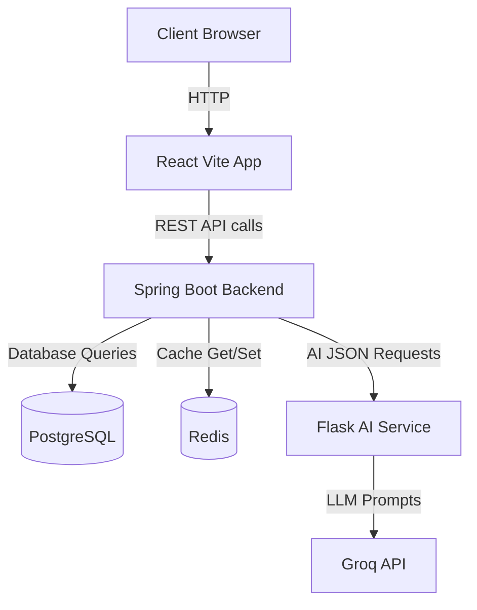

# Cyber Asset Discovery Scanner

## Overview
This project is a web application used to manage and analyze cyber assets. It includes a Spring Boot backend, a React/Vite frontend, and a Flask AI service for intelligent recommendations, containerized using Docker-compose.

## Architecture
- **Frontend:** React (Vite) on port 80
- **Backend:** Spring Boot (Java) on port 8080
- **AI Service:** Flask (Python) on port 5000
- **Database:** PostgreSQL on port 5432
- **Cache:** Redis on port 6379

## Prerequisites
- Docker and Docker Compose
- (Optional) Java 17, Node.js 18+, Python 3.10+ for local non-containerized execution

## Setup Steps
1. Clone the repository
2. Rename `.env.example` to `.env` and fill the variables (like `GROQ_API_KEY`).
3. Run `docker-compose up -d --build` to launch all services.

## Architecture Diagram

## Environment Variables (.env)
| Variable | Description |
|---|---|
| `GROQ_API_KEY` | Groq API Key for AI service |
| `DB_NAME` | PostgreSQL DB Name |
| `DB_USERNAME` | PostgreSQL User |
| `DB_PASSWORD` | PostgreSQL Password |
| `REDIS_PASSWORD` | Redis Password |
| `JWT_SECRET` | Secret key for issuing JWT tokens |
